# LINUX COMMANDS IMPLEMENTATION  

## PREREQUISITES
- Install Virtual Box
- Download Ubuntu
- Open up a terminal 

## STEP 1 - USING SUDO COMMAND

Using the sudo command gives root permissions to perform tasks. As seen in the image, the server is upgraded.
`sudo apt update`

## STEP 2 - USING PWD COMMAND

Using the pwd command to print the current working directory, as used in the below images.
`pwd`

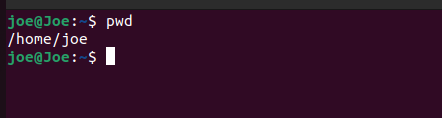

## STEP 3 - USING CD COMMAND

Using the cd command, helps to change current working directory to another directory as used in the image below.
`cd`

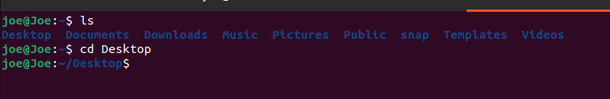

## STEP 4 - USING LS AND CAT COMMANDS

Using the ls to list contents: files and folders in a directory.

Using the cat command to show or display the contents of a file.

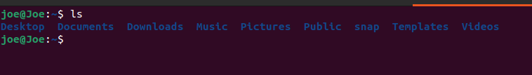

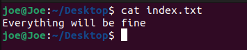

## STEP 5 - USING CP AND MV COMMANDS

Using the cp command to copy contents of a file and directory to another.

Using the mv command to entirely move files from a directory to another. It acn also be used to rename a file.

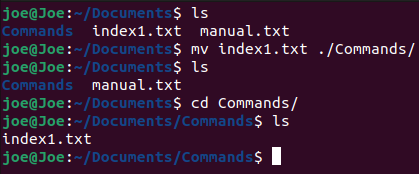

## STEP 6 - USING MKDIR AND RMDIR COMMANDS

Using the mkdir command to make or create a directory.

The rmdir command can also be used to remove or delete any directory.

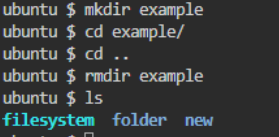

## STEP 7 - USING RM AND TOUCH COMMANDS

Using the touch command to create files as seen in the image.

The rm command can also be used to remove or delete files in a directory

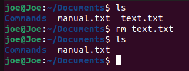

## STEP 8 - USING FIND COMMAND

Using the find command to search for a particular file in a directory.

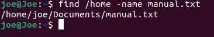

## STEP 9 - USING DF COMMAND

Using the df command to check for disk space usage for directoriesas seen in the image.

## STEP 10 - USING HEAD AND TAIL COMMANDS

Using the head command to view the ten lines of a text while the tail command to view the last ten lines.

## STEP 11 - USING DIFF COMMAND

Using the diff commmand to check for differnces between two files, by dispalyiong parts that do not match.

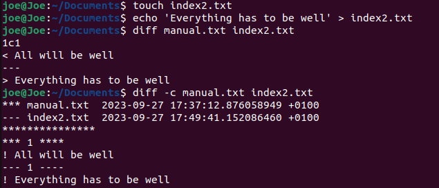

## STEP 12 - USING CHMOD COMMANDS

Using the chmod command to change permissions to read, write and execute files. In the image below, full permission is given to user, group and others.

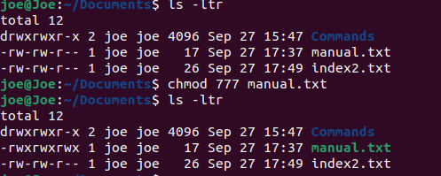

## STEP 13 - USING PING COMMAND

Using the ping command to check if a network is reachable, in my case, Google.

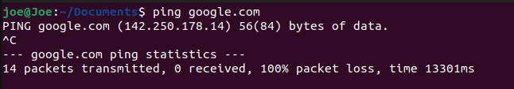

## STEP 14 - USING ZIP AND UNZIP COMMANDS

Using the zip command to compress files into one and using the unzip command to decompress the zipped file.

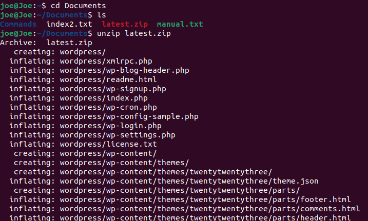

## STEP 15 - USING WGET COMMAND

Using the wget command to download files and contents from the internet.

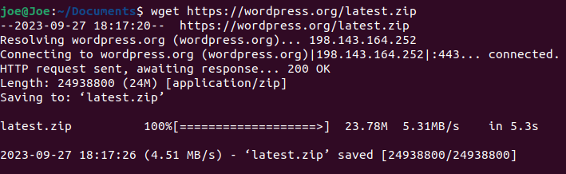