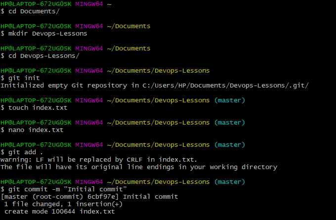

# GIT IMPLEMENTATION

## PREREQUISITES
- Install Git
- Open Linux Terminal
- Have a GitHub Account

## STEP 1 - GIT INITIALISE

It is important to initialise git in the working folder or directory using `git init` command. In the image below, a folder is created and git initialised. A file with content is created. The `git add` command adds the file created to git staging area. A commit message is provided as well.

## STEP 2 - GIT BRANCH AND CHECKOUT

To correct errors or work collaboratively as a group, branches are created asides the master branch. The below image shows that another branch is created and switched into, highlighting the existing branches. 

## STEP 3 - GIT BRANCH MERGE

In the advent of adding contents of two branches together, the `git merge` command as seen in the image below does the merging. The index.txt and its contents of the master branch is added into the 'new-branch' branch. 

## STEP 4 - GIT BRANCH DELETION

As seen in the image below, the 'new-branch' branch is deleted when it is no longer needed. Showing only the master branch left.

## STEP 5 - GIT PUSH

With the successful creation of a Github account and repository, the link to the repository is copied. As seen in the image below, the link is added with the `git remote add origin` command, followed by pushing it onto github with `git push` command. The file and content becomes visible and accessible on the GUI Github.

## STEP 6 - GIT CLONE

To have a copy of a file or folder from Github to local devices or storage, the `git clone` command is used. As seen in the image below, a repository link is copied and the its content are copied or downloaded on the local machine.

